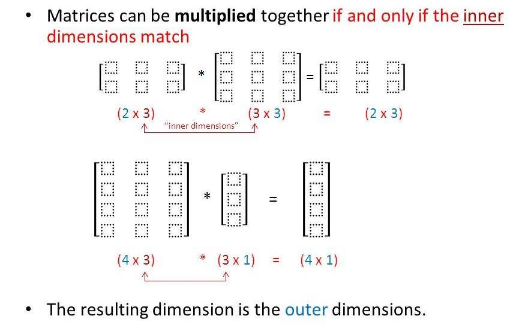

I set my knitr functions. 
```{r}
### Knitr options
knitr::opts_chunk$set(warning=FALSE,
                     message=FALSE,
                     fig.align="center"
                     )

options(warn=-1) # Hides all warnings, as the knitr options only work on local R-Markdown mode. 
```

I load my packages. 
```{r}
library(rmarkdown)
library(tidyverse)
```


# Intro

The purpose of these notes is to form all prerequisites for the course Advanced econometrics. Below is the complete list:

* Order conditions 1th, 2th, 3th. 
* Linear algebra
* Eigenvalues and eigenvectors
* Polynial (unity circle)

# Tips and tricks for markdown

Links:
<http://www.rstudio.com> [link](www.rstudio.com)

Internal doc links: Jump to [Header 1](#anchor)

* unordered list 
  + sub-item 1 
  + sub-item 2
    - sub-sub-item 1
* item 2
Continued (indent 4 spaces)

1. ordered list 2. item 2
i) sub-item 1
A. sub-sub-item 1

(@) A list whose numbering 
continues after
(@) an interruption

Common text commands:
Alt+i: |
Alt+=: ≠

*Text italic style*
**Text bold style**
_Text italic_
__Text bold__

In line code: 
`x<-10` 

# Linear algebra

The info is based on:

Datacamp kursus: https://campus.datacamp.com/courses/linear-algebra-for-data-science-in-r/matrix-vector-equations?ex=15 

khanacademy: https://www.khanacademy.org/math/precalculus/precalc-matrices/representing-systems-with-matrices/a/representing-systems-with-matrices?modal=1

matrixkursus: http://chortle.ccsu.edu/vectorlessons/vmch13/vmch13_19.html 

Dansk r/matrix kursus: https://www.math.uh.edu/~jmorgan/Math6397/day13/LinearAlgebraR-Handout.pdf

Youtube channel series on linear algebra: https://www.youtube.com/watch?v=kjBOesZCoqc&t=1s

## Vectors

Vectors can be seen as a list of numbers, a direction(arrow) in space. 

In linear algebra the vectors are always rooted in the origin. Origin is the center of space(axis). 

In a vector the 1. value is the movement in the (x) axis, 2. value is the movement in the (y) axis, the 3. value is the movement in the (z) axis and ect. for more dimensions.  

$\begin{bmatrix} -2 \\ 3 \end{bmatrix}$

Positive values are a movement to the right and negatives a movement to the left for x-values. For y positive is up, and negative is down. 

The sum of 2 vectors, is to add them together. As vectors can be interpreted as movents, we add the 2 movements together. 

$\begin{bmatrix} 1 \\ 2 \end{bmatrix}+ \begin{bmatrix} 3 \\ -1 \end{bmatrix} = \begin{bmatrix} 4 \\ 1 \end{bmatrix}$

As you can see from above we just add the numbers in the same dimensions together. 

Vectors can also be multiplied by a number/scalar. Here we just scale/stretch the vector by a number. For a negative, we flip it and then scale it. 

$2 \begin{bmatrix} 1 \\ 2 \end{bmatrix}= \begin{bmatrix} 2 \\ 4 \end{bmatrix}$

### Basis vectors:
It can be nice to think about vector values as scalars stretching out the **basis vectors**. With $\hat{i}$ being the basis vector for the **x axis** having the value +1 pointing right, and $\hat{j}$ being the basis cector for the **y axis** having the value +1 pointing up. This implies that we can choose different basis vectors and thereby creating different coordinate systems. When we describe vectors numerically, we implicitly assume some coordinate system. 

The **span** of two(in 2D) given pairs of vectors, is the set of all their linear combinations. If both pairs of vectors can move, every point in the coordinat system can be reached (span is the whole space). If both vectors are pointing in the same direction it becomes 1 line. If both vectors are in the center it becomes a point. If we fix one scalar, then the other one can only move in a straight line. In these cases where 1 vectors is redundant eg. does not affect **span**, we say it's **linearly dependent**. The vector can then be expressed as a linear combination of the other vector. If the vector is not redundant, then we say it's **linearly independent**. 

When dealing with a lot of vectors it can be usefull to imagine the vectors as a point which is the end/tip of the vector. Instead of a line from the origin. 

## Linear transformation
Transformation can here be understood as function (takes input and gives output). In this way the transformation moves the input vector to the output vector, which it does by moving all of space around. Linear transformations can turn and stretch space out, but must keep origin in place, and grid lines parralel and equally spaced. Matrix vector equation can generally be written as: (Ax = B).

To transform space and get information about how every object is transformed, we only need information about how the basis vectors are transformed. 

Consider the vectors:
$\overrightarrow{v} = -1 \hat{i} + 2 \hat{j}$

Then after transforming. V will land $-1$ times where $\hat{i}$ landed, plus $2$ times where $\hat{j}$ landed. 

For this transformation $\hat{i}$ landed at $\begin{bmatrix} 1 \\ -2 \end{bmatrix}$ and $\hat{j}$ landed at $\begin{bmatrix} 3 \\ 0 \end{bmatrix}$. 

This means that $\overrightarrow{v}$ lands at:

$-1 \begin{bmatrix} 1 \\ -2 \end{bmatrix} +2 \begin{bmatrix} 3 \\ 0 \end{bmatrix} = \begin{bmatrix} -1(1)+2(3) \\ -1(-2)+2(0) \end{bmatrix} = \begin{bmatrix} 5 \\ 2 \end{bmatrix}$.

In general we can write:

$x \begin{bmatrix} a \\ c \end{bmatrix} + y \begin{bmatrix} b \\ d \end{bmatrix} = \begin{bmatrix} ax + by \\ cx + dy \end{bmatrix}$

Calculating this in R:
```{r}
i_hat <- c(1,-2) #Coordinates for where i hat lands. 
j_hat <- c(3,0) #Coordinates for where j hat lands. 
x <- -1 
y <- 2
result <- x*i_hat+y*j_hat
result
```

The $\hat{i}$ and $\hat{j}$ can be interpreted as a 2x2 matrix describing a linear transformation. Then if you are given a vector as in this case $\begin{bmatrix} -1x \\ 2y \end{bmatrix}$, then you can use the above calculation to find where it lands. Below is 2 other examples of transformations with the same vector. 

90 degree rotation counter clockwise transformation. 
```{r}
i_hat <- c(0,1) #Coordinates for where i hat lands. 
j_hat <- c(-1,0) #Coordinates for where j hat lands. 
x <- -1 
y <- 2
result <- x*i_hat+y*j_hat
result
```

Shear transformation. 
```{r}
i_hat <- c(1,0) #Coordinates for where i hat lands. 
j_hat <- c(1,1) #Coordinates for where j hat lands. 
x <- -1 
y <- 2
result <- x*i_hat+y*j_hat
result
```

## What is a matrix?
Matrix can be seen as a storage of data. The matrix can be seen as a linear transformation aka. changing existing vectors, objects ect. Mutipliying a matrix with a vector, is what it means to apply the transformation to that vector. 

Matrix have rows and columns. Is written in the following form:
rows x columns.

Each number is called a element and have a specific location. 

Matrix: 
$A_{m,n} = \begin{pmatrix} a_{1,1} & a_{1,2} & \cdots & a_{1,n} \\ a_{2,1} & a_{2,2} & \cdots & a_{2,n} \\ \vdots  & \vdots  & \ddots & \vdots  \\ a_{m,1} & a_{m,2} & \cdots & a_{m,n} \end{pmatrix}$

Column matrix/vector: (M x 1). Consist of a single column of "M" elements. 
Row matrix/vector (1 x M). Consist of a single row of "M" elements. 

### Addition and subtraction
Can only be added or subtracted if they have exactly the same size. 

$a=\begin{pmatrix} a_{11} & a_{12} \\ a_{21} & a_{22} &\end{pmatrix}$

$b=\begin{pmatrix} b_{11} & b_{12} \\ b_{21} & b_{22} &\end{pmatrix}$

$a+b=a=\begin{pmatrix} a_{11}+b_{11} & a_{12}+b_{12} \\ a_{21}+b_{21} & a_{22}+b_{22} &\end{pmatrix}$

This makes sense as addition is the 2 movements combined together.

### Matrix multiplication
Often time we want to describe the affects of several matrixes (linear transformations). The overall effect is another new linear transformation distinct from the initial transformations, so that it is one action. This is called **composition**. When taking the product of several matrixes, do it from the right to left, as the order matter. We can think of this as the columns of the right matrix to be the initial location of the basis vectors, and then apply the transformation of the left matrix. Then it's really just several vectors mulitplied by a matrix. 

Matrixes can be multiplied together if: 
The inner dimensions match: ex. 2x3 times 3x3, or 4x3 times 3x1. 
The dimensions then become the outher dimensions: ex. 2x3, or 4x1.

Explained in the below image:
 
This is also another example on why the order matter when you multiply it. 

I define 2 matrixes and then i multiply them. 
```{r}
Vector1 <- c(1,-2,0,4) # define vector
A <- matrix(Vector1, 2,2, byrow = TRUE) # make matrix

Vector2 <- c(3,-4,1,0) # define vector
B <- matrix(Vector2, 2,2, byrow = TRUE) # make matrix
# Matrix multiplication

A%*%B
```

In 3D we in addition have the z dimension and the basis vector is called $\hat{k}$. Here a 3x3 matrix describes the linear transformation, where each column describes the transformation of each basis vector. 

### The determinant
The determinant is how much the "area" is scaled(increases in size) by the linear transformation. We can think of this area of the basis vector, but it really describes the factor whereby all of space is scaled. This is called the **determinant** "det". 

The **determinant** increases space if it's bigger than 1. If it's less than 1, then it shrinks the area. If it is 0, if it shrinks all of the area into a line or a single point. If it is negative then i flips all of space, but the absolute value still tells how much space has increased in size. We can interpret the flip as the basis vectors having opposite positions to each other, compared to normal. 

In 3D we can think of the determinant as telling how much the volume is being scaled. 

$det(\begin{bmatrix} a & b \\ c & d \end{bmatrix}) = ad - bc$

If we assume "b" and "c" to be 0. We can understand this as "a" being how much $\hat{i}$ is being stretched in the x-direction, and "d" tells how much $\hat{j}$ is being stretched in the y-direction. Then it's just multiplying a times d. If only one of b or c is 0, the determinant is still the same, but the area is just stretched to not be a rectangle, but instead a parallelogram. If both b and c takes values, it roughly tells how much the paralellogram is stretched in the diagonal direction. 

$\begin{bmatrix} a & b \\ c & d \end{bmatrix}$

### Linear system of equations

Here we have a linear system of equations. Here we line up variables, we add 0 if there is no variable in that equation. We have all the constants on the right side. 
$\begin{bmatrix} 2x + 5y + 3z = -3 \\ 4x + 0y + 8z = 0 \\ 1x + 3y + 0z = 2 \end{bmatrix} \Rightarrow \begin{bmatrix} 2 & 5 & 3 \\ 4 & 0 & 8 \\ 1 & 3 & 0 \end{bmatrix} \begin{bmatrix} x \\ y \\ z \end{bmatrix} = \begin{bmatrix} -3 \\ 0 \\ 2 \end{bmatrix}$

We can also formally denote this:

$A \overrightarrow{x} = \overrightarrow{v}$

We can understand this as we are looking for a vector as, that after applying the matrix/linear transformation A lands on the vector v.

### Inverse matrixes

If the determinant is non-zero, there will only be one vector x that lands on the vector v. When you show the linear transformation in reverse, this is the inverse linear transformation. The property of the inverse is that you apply it after the transformation, then you are back to the initial start, and you have done nothing. 

The linear transformation that is doing nothing is called the identity matrix. 

$A^{-1}A = I = \begin{bmatrix} 1 & 0 \\ 0 & 1 \end{bmatrix}$

### Solving the system of equations. 

We can solve our equation $A \overrightarrow{x} = \overrightarrow{v}$ by first finding the inverse and then applying it to both sides in the equation.

$\overrightarrow{x} = A^{-1} \overrightarrow{v}$

Now we have isolated the vector x which we wanna find. 

Typically if we have as many equations as unknowns, then there is one solution. If we have more equations than unknowns, then one equation should be abundant so we can combine them to solve. 

Property to ensure a unique solution: 
The matrix A must have an inverse (except, a few rare cases).
The determinant of A is nonzero. 
The rows and colums of A form a basis for the set of all vectors with n elements (something to do with basis vectors have a unique solution).

Example calculating in R: 
```{r}
A
Ainv <- solve(A) # solving finds the inverse if it exists (can only be sqaure matrixes, but not all), are unique. 
Ainv
Ainv %*% A # Invirse A times A is the I(identity) matrix. 

det(A) # finding the determinant
```

No solution(inconsistent): Visualized by 2 lines being parallel. 
1 solution(consistent): Visualized by 2 lines intersecting one time. 
Infinit solutions: Visualized by 2 lines being the same, therefore intersecting infinitly. 

### Augmented Matrix and operations rules
A system of equations can be represented by an augmented matrix. 
Here each row represents one equation, and each column represent a variable or constant. 

Row operations:
Switch any 2 rows
Multiply a row by a nonzero constant.
Add one row to another. We can do this because of the following rule:
If A=B and C=D, then A+C=B+D, which is the same as adding rows. But remember not to remove any rows, we just add!!!

When solving this by hand, we use these operations in combination to make the variables (left hand side) become a form where they only have values in the diagonal, resulting in them equaling the constants (right hand side). 

### Rank and column space
If the output of a transformation is a line it's rank 1. If it's a plane it's rank 2. If it's a 3D space, it's rank 3. So rank is the number of dimensions. Set set of all possible outputs is called the column space. If the number of dimensions is equal to the number of columns in the matrix, we call it full rank. 

### Non-square matrixes

Example: A 3 x 2 matrix (3 rows, 2 columns), can be interpreted as a 2D plane slicing through a 3 space. It's full rank, as the number of dimensions is equal to the number of columns in the matrix. The input is 2D and the output is 3D. There can be many such matrixes/transformations. 

Some options for non-square matrices:
Row reduction (by hand, difficult for big problems)
OLS (if more rows than columns), many observations and few variables. 
Singular value decompositions (of more columns than rows - used in principal component analysis)
Generalized or pseudo-inverse. 

### Dot product and duality
If we have 2 vectors of the same dimensions, then we take the product of each dimensions, and then add everything together. 

$\begin{bmatrix} 4 \\ 1 \end{bmatrix} * \begin{bmatrix} 2 \\ -1 \end{bmatrix} = 4*2 + 1*(-1) = 8 + (-1) = 7$

We can imagine this as a line from origin through one of the vectors. Then the other vector projected down (so that it have a 90 degree on the line). The new projected vector is now aligned with the first vector. If we then take the product of the length of the 2 "new" vectors we have the dot product. If one vector is pointing in the opposite direction, the dot product becomes negative. If the 2 vectors are perpendicular (90 degree), then the product becomes 0. Order does not matter. 

### Cross product

When you take the determinant to 2 vectors, you get the area of the parallelogram the 2 vectors form. This becomes the length of the new cross product vector, which also are perpendicular to the parallelogram. 

### Change of basis

As standard we think of $\hat{i}$ of a scaler of x and $\hat{j}$ as a scaler of y. We can think of these 2 as implicit assumptions about the coordinate system. We think of these basis vectors of our standard coordinate system. 

Instead we can choose different basis vectors. In these way we can have the "same" vector, descriped by different coordinat systems, and therefore have different numbers. The origin is still the same, but the spacing in the coordinat system is different. 

How do we translate between different systems? We can think of a matrix as a linear transformation, and then after the transformation is applied this new coordinate system is the new standard. We can always take the inverse to transform back into the standard coordinate system. 

# Eigenvectors and Eigenvalues

Link: https://www.youtube.com/watch?v=PFDu9oVAE-g (3Blue1Brown) vizualized. 

Eigenvalues and Eigenvectors come in pairs. 

When linear transformations happens, then most vectors get's knocked of their initial span (meaning: the line passing through it's origin and the "tip" of the vector). After the transformation they will have a new span and they might have been scaled/stretched. 

Some vectors don't get knocked of their span, but are only scaled, just as with scalar products. These vectors are called eigenvectors. Eigenvalues are the value describing the factor whereby a linear transformation scale/stretch. Because of linearity this implies that every vector on these eigenvectors are gonna be stretched in the same way. There can be several eigenvectors of a transformation, and they can stretch by different values. There can also be no eigenvectors or unlimited. 

Can be negative and positive. Negative meaning that it get's flipped. For a linear transformation in 3D, the eigenvector would be the axis of rotation, as the span(direction of vector) is still the same. 

As basis vectors depends on the coordinate system, eigen vectors and values are a universal way to describe the transformation. 

A: transformation matrix 
$\lambda$: Eigenvalue
$\overrightarrow{v}$: Eigenvector

$A \overrightarrow{v} = \lambda \overrightarrow{v}$

We see that the matrix-vector multiplication gives the same as a scalar multiplication of the eigenvalue. 

To solve this we need to find the eigenvalue and the $\overrightarrow{v}$, we do this by find $\lambda$ and $\overrightarrow{v}$ that makes the previous equation true. 

We can now write the identitymatrix scaled by lamda (a number), so that lamda scales all of the basis vector.  

$ \lambda \begin{bmatrix} 1 & 0 & 0 \\ 0 & 1 & 0 \\ 0 & 0 & 1\end{bmatrix}$

We can rewrite the equation to be: 

$A \overrightarrow{v} = (\lambda I) \overrightarrow{v}$

Now that both sides a matrix vector multiplication we can subtract the right hand side. 

$A \overrightarrow{v} - (\lambda I) \overrightarrow{v} = \overrightarrow{0}$

Then factor out the $\overrightarrow{v}$.

$ (A  - \lambda I) \overrightarrow{v} = \overrightarrow{0}$

Now we can subtract the two matrixes from each other. 

The matrix could look something like: 

$ \begin{bmatrix} 3 - \lambda & 1 & 4 \\ 1 & 5 - \lambda & 9 \\ 2 & 6 & 5 - \lambda \end{bmatrix} $

If the eigenvector in the equation becomes 0, then the equation would always hold, and the output would be the $\overrightarrow{0}$.

$ (A  - \lambda I) \overrightarrow{v} = \overrightarrow{0}$

What we want is a nonzero solution for $\overrightarrow{v}$. The only way that the product of the matrix becomes a zero vector, when we have a non zero vector $\overrightarrow{v}$, is if the matrix transforms space into a lower dimension, which means the determinant will be 0. So to solve we need to adjust lambda, so that the determinant will be 0, and space is squished to a lower dimension. 

This can be written as: 

$det(A - \lambda I) = \overrightarrow{0}$

When we have a matrix with only values on the diagonal, we call it a Diagonal matrix. We can interpret this as all the basis vectors being eigenvectors, and the values being the eigenvalues. 

Below i print the matrix A, and then the diagonal of A.
```{r}
A
diag(A) # takes the diagonal
```

### Transposing a matrix/vector
Transposing of a matrix is a new matrix whose rows are the columns of the original, and the columns become rows. Another to look it is that element $a_{rc}$ becomes $a_{cr}$ in the transposed matrix. This also means the matrix can change dimensions so a 2x3 matrix becomes a 3x2 matrix. For square matrices, the diagonal valus does not change positions. 

Here i show a matrix A, and then the transpose of it. 
```{r}
A
t(A)
```


